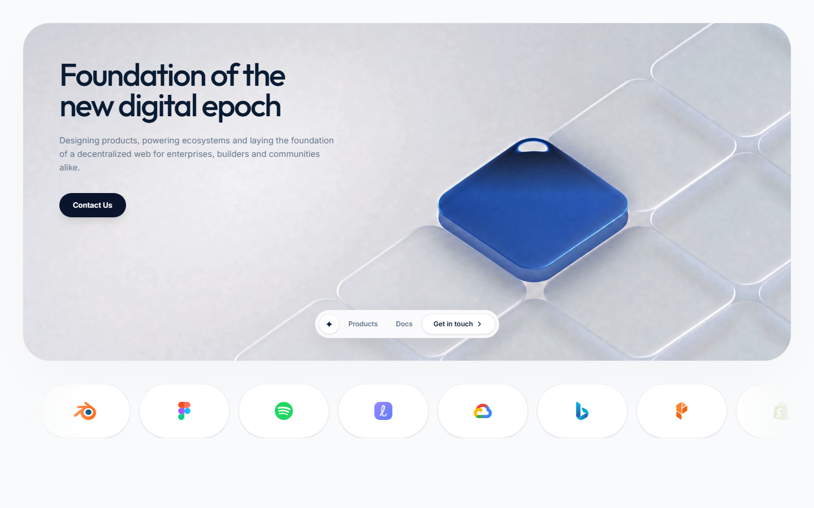
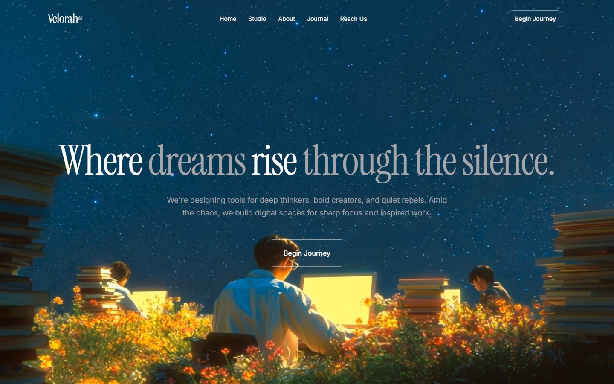
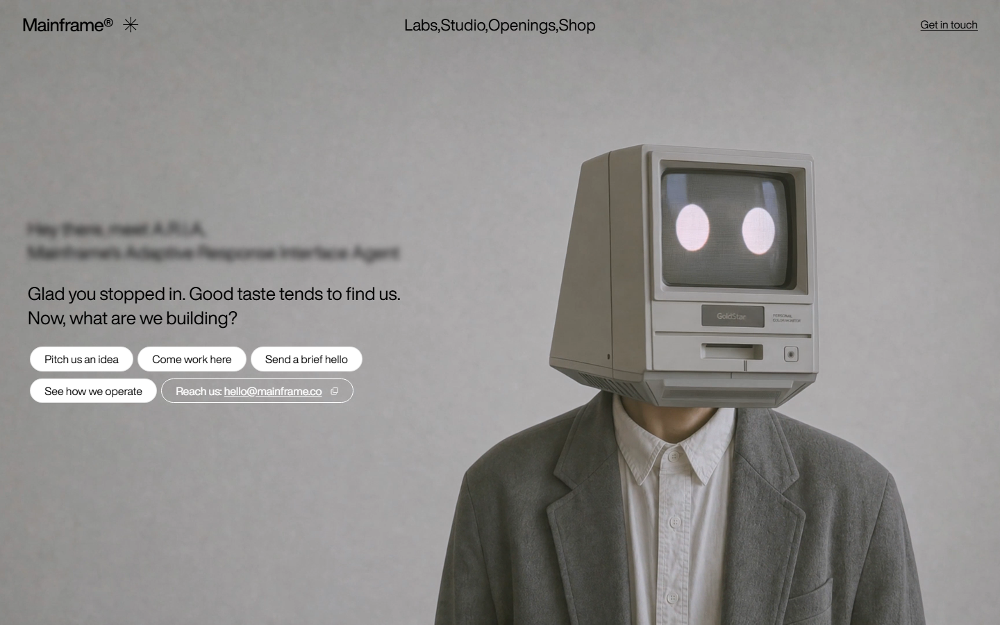
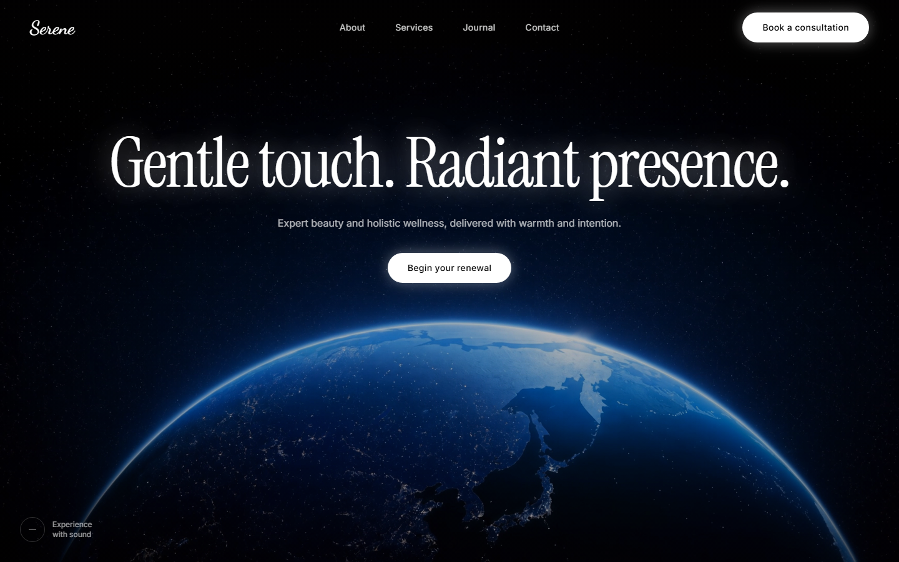
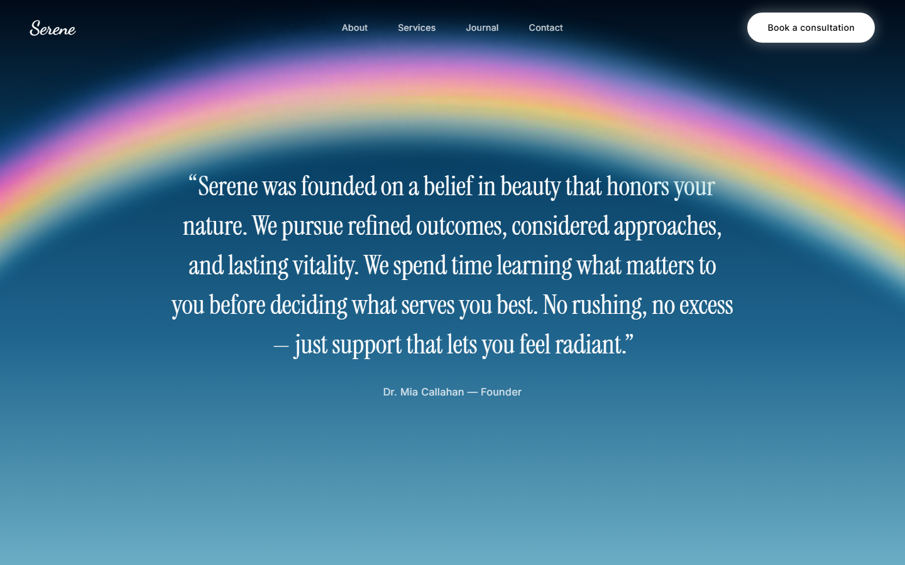

# Animated background references

This directory preserves four animated background experiments from the desktop folders `New folder (5)` through `New folder (8)`. Each reference includes the original React/Vite source and a static screenshot so the design can be recognized in GitHub without running it.

The screenshots are intentionally committed because the moving backgrounds use remote video or image URLs that may change or disappear.

## 1. Frosted video card + logo marquee

Original: `New folder (5)`



- Rounded, light video hero inside a large frosted card
- Floating pill navigation
- Infinite partner-logo marquee with gradient hover states
- Main implementation: [`App.tsx`](./frosted-video-card-marquee/source/src/App.tsx) and [`index.css`](./frosted-video-card-marquee/source/src/index.css)

## 2. Cinematic liquid-glass video

Original: `New folder (6)`



- Full-viewport cinematic background video
- Liquid-glass buttons and restrained text entrance animations
- Serif display typography over a dark blue scene
- Main implementation: [`App.tsx`](./cinematic-liquid-glass-video/source/src/App.tsx) and [`index.css`](./cinematic-liquid-glass-video/source/src/index.css)

## 3. Mouse-scrub video + typewriter

Original: `New folder (7)`



- Horizontal mouse movement scrubs the background video's timeline
- Typewriter introduction with a blinking cursor
- Minimal monochrome controls over a full-screen scene
- Main implementation: [`App.tsx`](./mouse-scrub-video-typewriter/source/src/App.tsx) and [`index.css`](./mouse-scrub-video-typewriter/source/src/index.css)

## 4. Serene video + rainbow/cloud parallax

Original: `New folder (8)`





- Full-screen space video with glow treatments
- Scroll-driven rainbow and cloud parallax using `requestAnimationFrame`
- Responsive glass navigation and mobile drawer
- Main implementation: [`Hero.tsx`](./serene-video-parallax-clouds/source/src/components/Hero.tsx), [`QuoteSection.tsx`](./serene-video-parallax-clouds/source/src/components/QuoteSection.tsx), and [`index.css`](./serene-video-parallax-clouds/source/src/index.css)

## Running a reference

From any reference's `source` directory:

```bash
npm install
npm run dev
```

These are isolated design references, not production imports. Adapt the relevant component and CSS to the target application instead of importing the whole Vite project.
